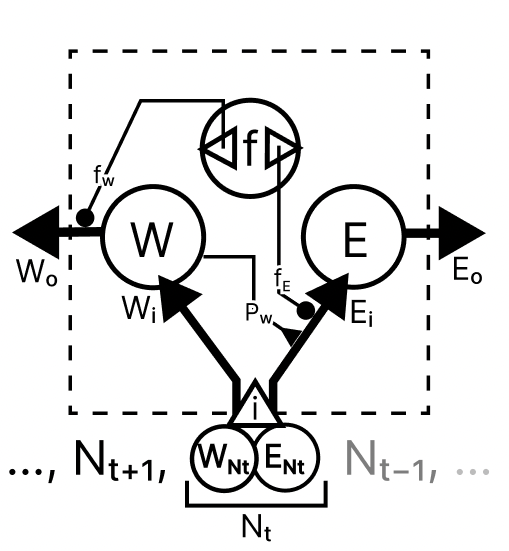

# Regulation Task
For investigating the relationship between physiological regulatory processes and cognition
--

 
## installation

1. In terminal, navigate to root of repository (folder containing setup.py)

2. make sure you the python environment you wish to install to is activated in the terminal 

3. run command
   ```pip install -e .```


## Use

### in python:

```
import gym
import regulation_task

env = gym.make("RegulationTask-v0")
```


and there you have your environment.


## Adapt to RL

Currently, the reward function in the environment is adapted to evolutionary algorithms, giving a reward of 1 for each timestep that the agent is alive.
You can go to 'regulation_task.py' and change the reward function (located in the step method of RegulationTask)
One possible reward function can be implemented by accessing the energy level of the agent.


#### Reward based on staying alive
```
# within step method of regulation_task.py

if self.alive == True:
            reward = 1       # <-- where reward is set
            done = False
        else:
            reward = 0
            done = True
```
#### Reward based on energy level
```
# within step method of regulation_task.py

if self.alive == True:
            reward = self.body.E      # <-- get energy varialbe level of agent
            done = False
        else:
            reward = 0
            done = True
```


now the agent is rewarded according to how 'satiated' it is at each time step

