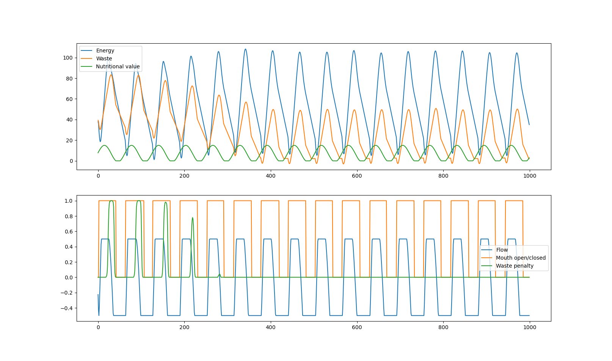

# Regulation Task
## A minimalist approach to investigating the relationship between physiological regulatory processes and cognition

>### [--Thesis google doc--](https://docs.google.com/document/d/1PajZf6r1QQUTJS9LNHCGfRXgicV37BbU3PBe8qx3AB0/edit#)

>### [Video of agent performing task](https://www.youtube.com/watch?v=-LgDBbVABHQ)


### Fig.1: The internal regulator
>From bottom to top:
>* A 'stream' of nutrients is flowing past the body of the >agent. $[Nt-1, Nt, Nt+2,...]$
>* The agent observes (among other things) the energy and waste contents in the stream at timestep $t$: $( WNt, ENt )$ and 
>* has to decide whether or not to allow this nutrient to enter its body. ( $i$ )
>* Once in the body, the nutrient is processed, releasing both the energy ( $Ei$ ) and waste products ( $Wi$ ) into the body. The amount of energy ( Ei ) extracted is modulated by three factors: 
>>  * the amount of energy originally present in nutrient: $(ENt)$
>>  * The amount of waste present in the body: $Pw(W)$
>>  * how much energy the system allocates to "digestion": $fE(f)$
> >>   * As follows: $Ei = ENt * Pw * fE$
>* The amount of waste added is equal to ( $WNt$ )
>* Then waste is removed from the body $(Wo)$:  $W --> W-fW(f)$
>* Energy is also "spent" at a constant rate $(Eo)$: $E --> E- bm$, where bm stands for "basal metabolism" 

### What does the agent DO?
The agent observes the state of its body, as well as the nutrients accessible to it, then decides whether or not to eat, and if it should focus on digesting or excreting waste.
* $f$ is an actuated variable, as is $i$
  * $f$ controls the proportion of energy directed to the $Ei$ and $Wo$ processes, where a low $f$ value means high waste excretion and a high $f$ value means efficient energy extraction.
  * $i$ controls whether or not a nutrient enters the body
* the sensed variables a given timestep are by default: $WNt, ENt, W, E, f, i$

### Fig.2 Figure depicting 1000 steps of a sucessful agent's performance

The environment of this agent is very controlled and noise-free, so these results are preliminary and not necessarily representative of what the environment is meant to do. The neural network controlling this agent has 3 hidden nodes and was evolved using evorobotpy2.

[evorobotpy2](https://github.com/snolfi/evorobotpy2)

---
...

## Installation

1. In terminal, navigate to root of repository (folder containing setup.py)

2. make sure you the python environment you wish to install to is activated in the terminal 

3. run command
   ```pip install -e .```


## Use

### in python:

```
import gym
import regulation_task

env = gym.make("RegulationTask-v0")
```


and there you have your environment.


## Change Reward Function

depending on what training strategy you are using, you will want to use different reward functions.
``` 
reward_function = "default"     
# 1 reward for each timestep spent alive
```
```
reward_function = "cumulativeE"     
# reward is equal to the current "satiety" of the agent
```
```
reward_function = "keramati_gutkin"   
# reward is equal to the squared gain of energy, can be negative (loss of energy)
```
```
env.set_rf(reward_function)
```

'default' and 'cumulativeE' works for evolutionary strategies, 'keramati_gutkin' is an experimental implementaion/inspiration of the homeostatic reward function as described in [Keramati and Gutkin (2014)](https://elifesciences.org/articles/04811).